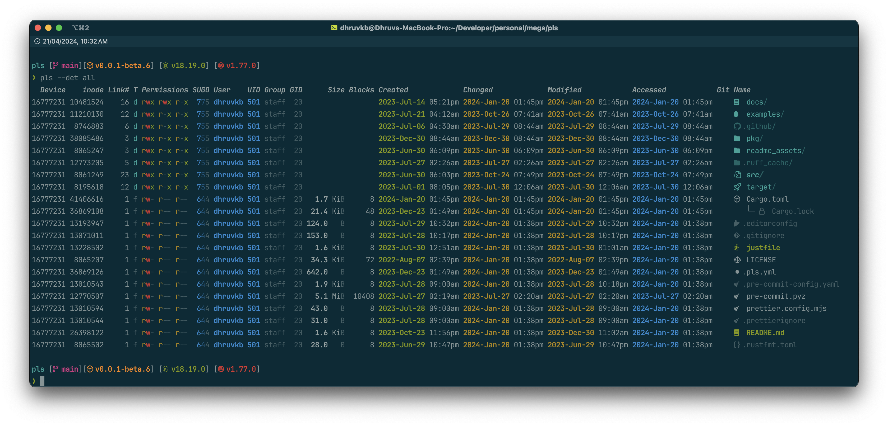
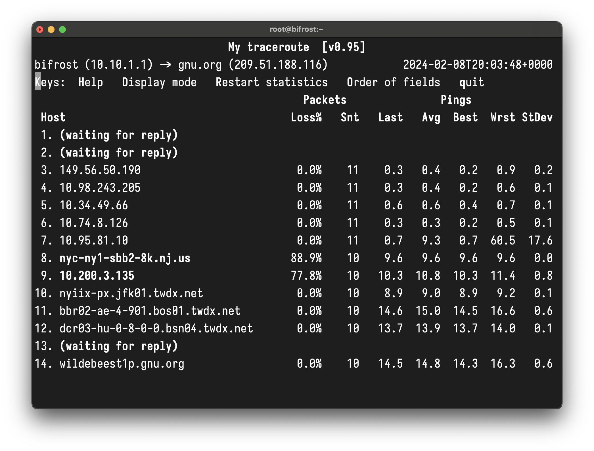
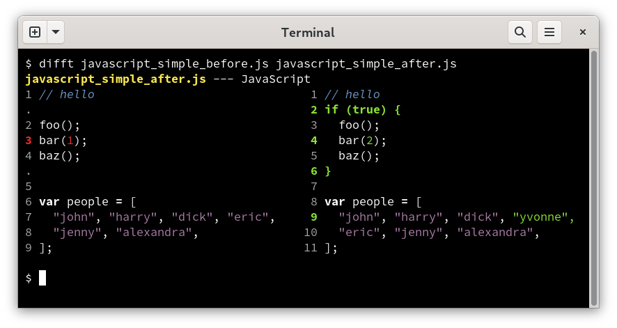

<h1 align="center">Modern Unix</h1>

<h2>Manual/Doc Utils</h2>

|             Name             | Description                                                                                                        | Status                                                               | Screenshot                                                                    |
| :--------------------------: | ------------------------------------------------------------------------------------------------------------------ | -------------------------------------------------------------------- | :---------------------------------------------------------------------------- |
|       [`cheat`][cheat]       | Create and view interactive cheatsheets on the command-line.                                                       | ![_][cheat-ghst] ![_][cheat-lang] ![_][cheat-ghlc]                   |          |
|        [`tldr`][tldr]        | A community effort to simplify `man` pages with practical examples.                                                | ![_][tldr-ghst] ![_][tldr-lang] ![_][tldr-ghlc]                      |            |

<h2>System Monitor Uitls</h2>

|             Name             | Description                                                                                                        | Status                                                               | Screenshot                                                                    |
| :--------------------------: | ------------------------------------------------------------------------------------------------------------------ | -------------------------------------------------------------------- | :---------------------------------------------------------------------------- |
|      [`bottom`][bottom]      | Yet another cross-platform graphical process/system monitor.                                                       | ![_][bottom-ghst] ![_][bottom-lang] ![_][bottom-ghlc]                |        |
|        [`btop`][btop]        | A monitor of resources                                                                                             | ![_][btop-ghst] ![_][btop-lang] ![_][btop-ghlc]                      |            |
|     [`glances`][glances]     | A `top`/`htop` alternative for most operating systems.                                                             | ![_][glances-ghst] ![_][glances-lang] ![_][glances-ghlc]             |      |
|        [`gtop`][gtop]        | System monitoring dashboard for terminal.                                                                          | ![_][gtop-ghst] ![_][gtop-lang] ![_][gtop-ghlc]                      |            |

<h2>GNU/*Nix Clone Utils</h2>

|             Name             | Description                                                                                                        | Status                                                               | Screenshot                                                                    |
| :--------------------------: | ------------------------------------------------------------------------------------------------------------------ | -------------------------------------------------------------------- | :---------------------------------------------------------------------------- |
|         [`bat`][bat]         | A `cat` clone with syntax highlighting and Git integration.                                                        | ![_][bat-ghst] ![_][bat-lang] ![_][bat-ghlc]                         |              |
|       [`broot`][broot]       | A new way to see and navigate directory `tree`s.                                                                   | ![_][broot-ghst] ![_][broot-lang] ![_][broot-ghlc]                   |          |
|      [`choose`][choose]      | A human-friendly and fast alternative to `cut` and (sometimes) `awk` .                                             | ![_][choose-ghst] ![_][choose-lang] ![_][choose-ghlc]                |        |
|   [`coreutils`][coreutils]   | Cross-platform Rust rewrite of the GNU [`coreutils`][gnu-coreutils] (by [`uutils`][uutils])                        | ![_][coreutils-ghst] ![_][coreutils-lang] ![_][coreutils-ghlc]       | NA                                                                            |
|         [`duf`][duf]         | A better `df` alternative.                                                                                         | ![_][duf-ghst] ![_][duf-lang] ![_][duf-ghlc]                         |              |
|        [`dust`][dust]        | A more intuitive version of `du` written in rust.                                                                  | ![_][dust-ghst] ![_][dust-lang] ![_][dust-ghlc]                      |            |
|         [`eza`][eza]         | A modern, maintained replacement for `ls`, built on `exa`.                                                         | ![_][eza-ghst] ![_][eza-lang] ![_][eza-ghlc]                         |              |
|          [`fd`][fd]          | A simple, fast and user-friendly alternative to `find`.                                                            | ![_][fd-ghst] ![_][fd-lang] ![_][fd-ghlc]                            |                |
|   [`findutils`][findutils]   | Rust implementation of [`findutils`][gnu-findutils] (by [`uutils`][uutils])                                        | ![_][findutils-ghst] ![_][findutils-lang] ![_][findutils-ghlc]       | NA                                                                            |
|         [`fzf`][fzf]         | A general purpose command-line fuzzy finder.                                                                       | ![_][fzf-ghst] ![_][fzf-lang] ![_][fzf-ghlc]                         |              |
|         [`lsd`][lsd]         | The next gen file listing command. Backwards compatible with `ls`.                                                 | ![_][lsd-ghst] ![_][lsd-lang] ![_][lsd-ghlc]                         |              |
|       [`mcfly`][mcfly]       | Fly through your shell `history`. Great Scott! .                                                                   | ![_][mcfly-ghst] ![_][mcfly-lang] ![_][mcfly-ghlc]                   |          |
|         [`pls`][pls]         | `pls` is a prettier and powerful `ls(1)` for the pros.                                                             | ![_][pls-ghst] ![_][pls-lang] ![_][pls-ghlc]                         |              |
|       [`procs`][procs]       | A modern replacement for `ps` written in Rust.                                                                     | ![_][procs-ghst] ![_][procs-lang] ![_][procs-ghlc]                   |          |
|     [`ripgrep`][ripgrep]     | An extremely fast alternative to `grep` that respects your gitignore.                                              | ![_][ripgrep-ghst] ![_][ripgrep-lang] ![_][ripgrep-ghlc]             |      |
| [`ripgrep-all`][ripgrep-all] | rga: ripgrep, but also search in PDFs, E-Books, Office documents, zip, tar.gz, etc.                                | ![_][ripgrep-all-ghst] ![_][ripgrep-all-lang] ![_][ripgrep-all-ghlc] |  |
|          [`sd`][sd]          | An intuitive find & replace CLI (`sed` alternative).                                                               | ![_][sd-ghst] ![_][sd-lang] ![_][sd-ghlc]                            |                |
|      [`trashy`][trashy]      | a cli system trash manager, alternative to rm and trash-cli                                                        | ![_][trashy-ghst] ![_][trashy-lang] ![_][trashy-ghlc]                |        |
|      [`zoxide`][zoxide]      | A smarter `cd` command inspired by `z`.                                                                            | ![_][zoxide-ghst] ![_][zoxide-lang] ![_][zoxide-ghlc]                |       |

<h2>Network Utils</h2>

|             Name             | Description                                                                                                        | Status                                                               | Screenshot                                                                    |
| :--------------------------: | ------------------------------------------------------------------------------------------------------------------ | -------------------------------------------------------------------- | :---------------------------------------------------------------------------- |
|      [`curlie`][curlie]      | The power of `curl`, the ease of use of `httpie`.                                                                  | ![_][curlie-ghst] ![_][curlie-lang] ![_][curlie-ghlc]                |        |
|       [`doggo`][doggo]       | 🐶 Command-line DNS client for humans. `dig` on steroids.                                                           | ![_][doggo-ghst] ![_][doggo-lang] ![_][doggo-ghlc]                   |          |
|       [`gping`][gping]       | `ping`, but with a graph.                                                                                          | ![_][gping-ghst] ![_][gping-lang] ![_][gping-ghlc]                   |          |
|      [`httpie`][httpie]      | A modern, user-friendly command-line HTTP client for the API era.                                                  | ![_][httpie-ghst] ![_][httpie-lang] ![_][httpie-ghlc]                |        |
|         [`mtr`][mtr]         | A network diagnostic tool, combining functionality of `traceroute` and `ping`                                      | ![_][mtr-ghst] ![_][mtr-lang] ![_][mtr-ghlc]                         |              |
|    [`rustscan`][rustscan]    | The Modern Port Scanner. Find ports quickly (3 seconds at its fastest). `nmap` alternative.                        | ![_][rustscan-ghst] ![_][rustscan-lang] ![_][rustscan-ghlc]          |    |
|          [`xh`][xh]          | A friendly and fast tool for sending HTTP requests.                                                                | ![_][xh-ghst] ![_][xh-lang] ![_][xh-ghlc]                            |                |

<h2>Git/Diff Utils</h2>

|             Name             | Description                                                                                                        | Status                                                               | Screenshot                                                                    |
| :--------------------------: | ------------------------------------------------------------------------------------------------------------------ | -------------------------------------------------------------------- | :---------------------------------------------------------------------------- |
|       [`delta`][delta]       | A viewer for `git` and `diff` output.                                                                              | ![_][delta-ghst] ![_][delta-lang] ![_][delta-ghlc]                   |          |
|   [`diffutils`][diffutils]   | Drop-in replacement of [`diffutils`][gnu-diffutils] in Rust (by [`uutils`][uutils])                                | ![_][diffutils-ghst] ![_][diffutils-lang] ![_][diffutils-ghlc]       | NA                                                                            |
|     [`lazygit`][lazygit]     | simple terminal UI for git commands                                                                                | ![_][lazygit-ghst] ![_][lazygit-lang] ![_][lazygit-ghlc]             |      |
|     [`difftastic`][difftastic]     | a structural diff that understands syntax 🟥🟩                                                               | ![_][difftastic-ghst] ![_][difftastic-lang] ![_][difftastic-ghlc]              |      |

<h2>Misc. Utils</h2>

|             Name             | Description                                                                                                        | Status                                                               | Screenshot                                                                    |
| :--------------------------: | ------------------------------------------------------------------------------------------------------------------ | -------------------------------------------------------------------- | :---------------------------------------------------------------------------- |
|       [`await`][await]       | 28Kb, small memory footprint, single binary that run list of commands in parallel and waits for their termination. | ![_][await-ghst] ![_][await-lang] ![_][await-ghlc]                   |          |
|   [`hyperfine`][hyperfine]   | A command-line benchmarking tool.                                                                                  | ![_][hyperfine-ghst] ![_][hyperfine-lang] ![_][hyperfine-ghlc]       |  |
|          [`jq`][jq]          | `sed` for JSON data.                                                                                               | ![_][jq-ghst] ![_][jq-lang] ![_][jq-ghlc]                            |                |

<!--Links-->

<!-- uutils -->

[uutils]: https://uutils.github.io
[gnu-coreutils]: https://www.gnu.org/software/coreutils
[gnu-diffutils]: https://www.gnu.org/software/diffutils
[gnu-findutils]: https://www.gnu.org/software/findutils

<!--await-->

[await]: https://github.com/slavaGanzin/await
[await-ghlc]: https://img.shields.io/github/last-commit/slavaGanzin/await?label=
[await-ghst]: https://img.shields.io/github/stars/slavaGanzin/await
[await-lang]: https://img.shields.io/github/languages/top/slavaGanzin/await

<!--bat-->

[bat]: https://github.com/sharkdp/bat
[bat-ghlc]: https://img.shields.io/github/last-commit/sharkdp/bat?label=
[bat-ghst]: https://img.shields.io/github/stars/sharkdp/bat
[bat-lang]: https://img.shields.io/github/languages/top/sharkdp/bat

<!--bottom -->

[bottom]: https://github.com/ClementTsang/bottom
[bottom-ghlc]: https://img.shields.io/github/last-commit/ClementTsang/bottom?label=
[bottom-ghst]: https://img.shields.io/github/stars/ClementTsang/bottom
[bottom-lang]: https://img.shields.io/github/languages/top/ClementTsang/bottom

<!--broot-->

[broot]: https://github.com/Canop/broot
[broot-ghst]: https://img.shields.io/github/stars/Canop/broot
[broot-ghlc]: https://img.shields.io/github/last-commit/Canop/broot?label=
[broot-lang]: https://img.shields.io/github/languages/top/Canop/broot

<!--btop-->

[btop]: https://github.com/aristocratos/btop
[btop-ghlc]: https://img.shields.io/github/last-commit/aristocratos/btop?label=
[btop-ghst]: https://img.shields.io/github/stars/aristocratos/btop
[btop-lang]: https://img.shields.io/github/languages/top/aristocratos/btop

<!--cheat -->

[cheat]: https://github.com/cheat/cheat
[cheat-ghlc]: https://img.shields.io/github/last-commit/cheat/cheat?label=
[cheat-ghst]: https://img.shields.io/github/stars/cheat/cheat
[cheat-lang]: https://img.shields.io/github/languages/top/cheat/cheat

<!--choose -->

[choose]: https://github.com/theryangeary/choose
[choose-ghlc]: https://img.shields.io/github/last-commit/theryangeary/choose?label=
[choose-ghst]: https://img.shields.io/github/stars/theryangeary/choose
[choose-lang]: https://img.shields.io/github/languages/top/theryangeary/choose

<!-- coreutils -->

[coreutils]: https://github.com/uutils/coreutils
[coreutils-ghlc]: https://img.shields.io/github/last-commit/uutils/coreutils?label=
[coreutils-ghst]: https://img.shields.io/github/stars/uutils/coreutils
[coreutils-lang]: https://img.shields.io/github/languages/top/uutils/coreutils

<!--curlie -->

[curlie]: https://github.com/rs/curlie
[curlie-ghlc]: https://img.shields.io/github/last-commit/rs/curlie?label=
[curlie-ghst]: https://img.shields.io/github/stars/rs/curlie
[curlie-lang]: https://img.shields.io/github/languages/top/rs/curlie

<!--delta-->

[delta]: https://github.com/dandavison/delta
[delta-ghst]: https://img.shields.io/github/stars/dandavison/delta
[delta-ghlc]: https://img.shields.io/github/last-commit/dandavison/delta?label=
[delta-lang]: https://img.shields.io/github/languages/top/dandavison/delta

<!-- diffutils -->

[diffutils]: https://github.com/uutils/diffutils
[diffutils-ghlc]: https://img.shields.io/github/last-commit/uutils/diffutils?label=
[diffutils-ghst]: https://img.shields.io/github/stars/uutils/diffutils
[diffutils-lang]: https://img.shields.io/github/languages/top/uutils/diffutils

<!--doggo -->

[doggo]: https://github.com/mr-karan/doggo
[doggo-ghlc]: https://img.shields.io/github/last-commit/mr-karan/doggo?label=
[doggo-ghst]: https://img.shields.io/github/stars/mr-karan/doggo
[doggo-lang]: https://img.shields.io/github/languages/top/mr-karan/doggo

<!--dust-->

[dust]: https://github.com/bootandy/dust
[dust-ghst]: https://img.shields.io/github/stars/bootandy/dust
[dust-ghlc]: https://img.shields.io/github/last-commit/bootandy/dust?label=
[dust-lang]: https://img.shields.io/github/languages/top/bootandy/dust

<!--duf-->

[duf]: https://github.com/muesli/duf
[duf-ghst]: https://img.shields.io/github/stars/muesli/duf
[duf-ghlc]: https://img.shields.io/github/last-commit/muesli/duf?label=
[duf-lang]: https://img.shields.io/github/languages/top/muesli/duf

<!--eza-->

[eza]: https://github.com/eza-community/eza
[eza-ghst]: https://img.shields.io/github/stars/eza-community/eza
[eza-ghlc]: https://img.shields.io/github/last-commit/eza-community/eza?label=
[eza-lang]: https://img.shields.io/github/languages/top/eza-community/eza

<!--fd -->

[fd]: https://github.com/sharkdp/fd
[fd-ghlc]: https://img.shields.io/github/last-commit/sharkdp/fd?label=
[fd-ghst]: https://img.shields.io/github/stars/sharkdp/fd
[fd-lang]: https://img.shields.io/github/languages/top/sharkdp/fd

<!--findutils -->

[findutils]: https://github.com/uutils/findutils
[findutils-ghlc]: https://img.shields.io/github/last-commit/uutils/findutils?label=
[findutils-ghst]: https://img.shields.io/github/stars/uutils/findutils
[findutils-lang]: https://img.shields.io/github/languages/top/uutils/findutils

<!--fzf -->

[fzf]: https://github.com/junegunn/fzf
[fzf-ghlc]: https://img.shields.io/github/last-commit/junegunn/fzf?label=
[fzf-ghst]: https://img.shields.io/github/stars/junegunn/fzf
[fzf-lang]: https://img.shields.io/github/languages/top/junegunn/fzf

<!--glances -->

[glances]: https://github.com/nicolargo/glances
[glances-ghlc]: https://img.shields.io/github/last-commit/nicolargo/glances?label=
[glances-ghst]: https://img.shields.io/github/stars/nicolargo/glances
[glances-lang]: https://img.shields.io/github/languages/top/nicolargo/glances

<!--gping -->

[gping]: https://github.com/orf/gping
[gping-ghlc]: https://img.shields.io/github/last-commit/orf/gping?label=
[gping-ghst]: https://img.shields.io/github/stars/orf/gping
[gping-lang]: https://img.shields.io/github/languages/top/orf/gping

<!--gtop -->

[gtop]: https://github.com/aksakalli/gtop
[gtop-ghlc]: https://img.shields.io/github/last-commit/aksakalli/gtop?label=
[gtop-ghst]: https://img.shields.io/github/stars/aksakalli/gtop
[gtop-lang]: https://img.shields.io/github/languages/top/aksakalli/gtop

<!--hyperfine -->

[hyperfine]: https://github.com/sharkdp/hyperfine
[hyperfine-ghlc]: https://img.shields.io/github/last-commit/sharkdp/hyperfine?label=
[hyperfine-ghst]: https://img.shields.io/github/stars/sharkdp/hyperfine
[hyperfine-lang]: https://img.shields.io/github/languages/top/sharkdp/hyperfine

<!--httpie -->

[httpie]: https://github.com/httpie/httpie
[httpie-ghlc]: https://img.shields.io/github/last-commit/httpie/httpie?label=
[httpie-ghst]: https://img.shields.io/github/stars/httpie/httpie
[httpie-lang]: https://img.shields.io/github/languages/top/httpie/httpie

<!--jq -->

[jq]: https://github.com/stedolan/jq
[jq-ghlc]: https://img.shields.io/github/last-commit/stedolan/jq?label=
[jq-ghst]: https://img.shields.io/github/stars/stedolan/jq
[jq-lang]: https://img.shields.io/github/languages/top/stedolan/jq

<!--lazygit -->

[lazygit]: https://github.com/jesseduffield/lazygit
[lazygit-ghlc]: https://img.shields.io/github/last-commit/jesseduffield/lazygit?label=
[lazygit-ghst]: https://img.shields.io/github/stars/jesseduffield/lazygit
[lazygit-lang]: https://img.shields.io/github/languages/top/jesseduffield/lazygit

<!--lsd-->

[lsd]: https://github.com/Peltoche/lsd
[lsd-ghst]: https://img.shields.io/github/stars/Peltoche/lsd
[lsd-ghlc]: https://img.shields.io/github/last-commit/Peltoche/lsd?label=
[lsd-lang]: https://img.shields.io/github/languages/top/Peltoche/lsd

<!--mcfly -->

[mcfly]: https://github.com/cantino/mcfly
[mcfly-ghlc]: https://img.shields.io/github/last-commit/cantino/mcfly?label=
[mcfly-ghst]: https://img.shields.io/github/stars/cantino/mcfly
[mcfly-lang]: https://img.shields.io/github/languages/top/cantino/mcfly

<!--mtr -->

[mtr]: https://github.com/traviscross/mtr
[mtr-ghlc]: https://img.shields.io/github/last-commit/traviscross/mtr?label=
[mtr-ghst]: https://img.shields.io/github/stars/traviscross/mtr
[mtr-lang]: https://img.shields.io/github/languages/top/traviscross/mtr

<!--pls -->

[pls]: https://github.com/pls-rs/pls
[pls-ghlc]: https://img.shields.io/github/last-commit/pls-rs/pls?label=
[pls-ghst]: https://img.shields.io/github/stars/pls-rs/pls
[pls-lang]: https://img.shields.io/github/languages/top/pls-rs/pls

<!--procs -->

[procs]: https://github.com/dalance/procs
[procs-ghlc]: https://img.shields.io/github/last-commit/dalance/procs?label=
[procs-ghst]: https://img.shields.io/github/stars/dalance/procs
[procs-lang]: https://img.shields.io/github/languages/top/dalance/procs

<!--ripgrep -->

[ripgrep]: https://github.com/BurntSushi/ripgrep
[ripgrep-ghlc]: https://img.shields.io/github/last-commit/BurntSushi/ripgrep?label=
[ripgrep-ghst]: https://img.shields.io/github/stars/BurntSushi/ripgrep
[ripgrep-lang]: https://img.shields.io/github/languages/top/BurntSushi/ripgrep

<!--ripgrep-all -->

[ripgrep-all]: https://github.com/phiresky/ripgrep-all
[ripgrep-all-ghlc]: https://img.shields.io/github/last-commit/phiresky/ripgrep-all?label=
[ripgrep-all-ghst]: https://img.shields.io/github/stars/phiresky/ripgrep-all
[ripgrep-all-lang]: https://img.shields.io/github/languages/top/phiresky/ripgrep-all

<!--rustscan -->

[rustscan]: https://github.com/RustScan/RustScan
[rustscan-ghlc]: https://img.shields.io/github/last-commit/RustScan/RustScan?label=
[rustscan-ghst]: https://img.shields.io/github/stars/RustScan/RustScan
[rustscan-lang]: https://img.shields.io/github/languages/top/RustScan/RustScan

<!--sd -->

[sd]: https://github.com/chmln/sd
[sd-ghlc]: https://img.shields.io/github/last-commit/chmln/sd?label=
[sd-ghst]: https://img.shields.io/github/stars/chmln/sd
[sd-lang]: https://img.shields.io/github/languages/top/chmln/sd

<!--tldr -->

[tldr]: https://github.com/tldr-pages/tldr
[tldr-ghlc]: https://img.shields.io/github/last-commit/tldr-pages/tldr?label=
[tldr-ghst]: https://img.shields.io/github/stars/tldr-pages/tldr
[tldr-lang]: https://img.shields.io/github/languages/top/tldr-pages/tldr

<!--trashy -->

[trashy]: https://github.com/oberblastmeister/trashy
[trashy-ghlc]: https://img.shields.io/github/last-commit/oberblastmeister/trashy?label=
[trashy-ghst]: https://img.shields.io/github/stars/oberblastmeister/trashy
[trashy-lang]: https://img.shields.io/github/languages/top/oberblastmeister/trashy

<!--xh -->

[xh]: https://github.com/ducaale/xh
[xh-ghlc]: https://img.shields.io/github/last-commit/ducaale/xh?label=
[xh-ghst]: https://img.shields.io/github/stars/ducaale/xh
[xh-lang]: https://img.shields.io/github/languages/top/ducaale/xh

<!--zoxide -->

[zoxide]: https://github.com/ajeetdsouza/zoxide
[zoxide-ghlc]: https://img.shields.io/github/last-commit/ajeetdsouza/zoxide?label=
[zoxide-ghst]: https://img.shields.io/github/stars/ajeetdsouza/zoxide
[zoxide-lang]: https://img.shields.io/github/languages/top/ajeetdsouza/zoxide

<!--difftastic -->

[difftastic]: https://github.com/Wilfred/difftastic
[difftastic-ghlc]: https://img.shields.io/github/last-commit/Wilfred/difftastic?label=
[difftastic-ghst]: https://img.shields.io/github/stars/Wilfred/difftastic
[difftastic-lang]: https://img.shields.io/github/languages/top/Wilfred/difftastic

<!--GH => GitHub -->
<!--ST => Stars -->
<!--LC => Last Commit -->
